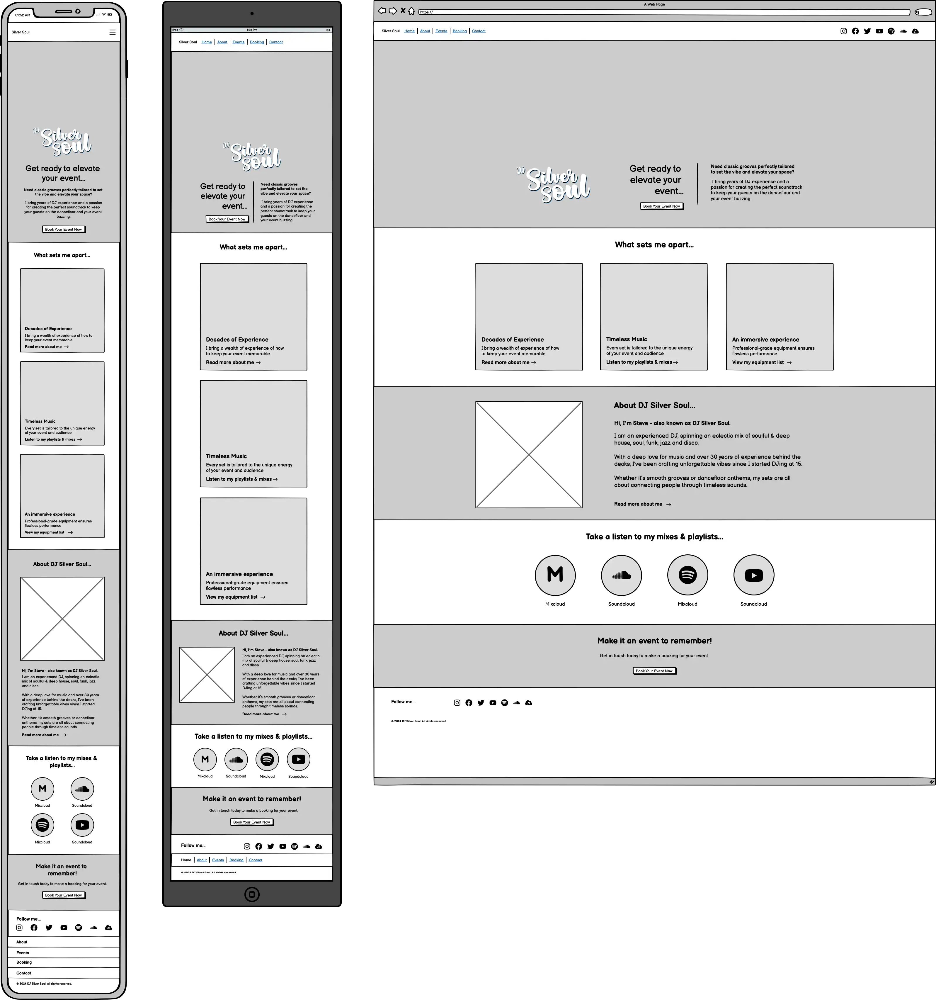

## Aim of the site

The goal of this website is to serve as a central hub for showcasing DJ Silver Soul’s 30+ years of DJing expertise, highlighting his passion for soulful & deep house, soul, funk, jazz, and disco.

The site is designed for event organizers and fans alike, offering an opportunity to explore his musical style, learn more about his extensive career, and book him for memorable events.

It is designed to:
	
1. **Engage and Inspire** - Highlight his timeless sounds, creating a deep connection with music lovers and event organisers
2. **Promote Accessibility** - Provide visitors with easy access to mixes, upcoming gigs, booking information, and social platforms
3. **Build Trust** - Showcase his extensive experience and passion for creating memorable, immersive musical experiences
4. **Modern and Functional Design** - Offer a sleek, user-friendly interface that embodies the energy and sophistication of my music
5. **Expand Reach** - Connect with a global audience, reinforcing my position as a trusted DJ for private events, clubs, and festivals

---

## CONTENTS

* [User Experience](#item-one)

* [Design](#item-two)
    * [Colour Scheme](#item-three)
    * [Typography](#item-four)
    * [Imagery](#item-five)
    * [Wireframes](#item-six)

---

## User Experience (UX)

The website is designed with user-centric principles to ensure a seamless and engaging experience for all visitors. 
The key UX considerations include:

1. **Intuitive Navigation** - A logical layout ensures that users can easily access key sections, such as mixes, booking information, and upcoming events
2. **Responsive Design** - The website is fully optimized for desktop, tablet, and mobile devices, providing a consistent and enjoyable experience across all screen sizes
3. **Engaging Visuals** - The use of bold typography, high-quality imagery, and dynamic backgrounds reflects the energy and style of the DJ's music
4. **Focus on Performance** - Lightweight code and optimized assets ensure fast load times, minimizing friction and keeping users engaged
5. **Clear Call-to-Actions (CTAs)** - Prominent and visually appealing CTAs guide users to important actions, such as streaming mixes or submitting a booking inquiry
6. **Accessibility** - The site follows modern accessibility standards, including high-contrast colors, readable fonts, and keyboard navigation support, ensuring inclusivity for all users
7. **Personal Connection** - Content is crafted to reflect the DJ's passion and experience

---

## Design

### Colour Scheme

The colour scheme of my site is inspired by the hero background image. This image evokes the vibrant atmosphere of a nightclub, with its interplay of dark spaces and dynamic highlights of orange and blue. These colors set the tone for a modern, energetic, and immersive user experience.

To create a cohesive and visually appealing color palette for my site, I used the [Palette Generator tool](https://palettegenerator.com/). This allowed me to extract the predominant colors directly from the hero background image.

Using this tool ensured that my color scheme harmonized with the key visuals of the site, creating a consistent and immersive user experience. To ensure consistency and maintainability, I declared all color values as CSS variables in the :root selector. This approach allows me to apply colors consistently throughout the site and makes it easy to update the color scheme by changing the values in one place.

The primary colors for my site are black and white, providing a clean and timeless foundation that enhances readability and usability.

To draw attention to key areas, I incorporated highlight colors:
* `#d27d60` Used to emphasize elements that convey warmth and energy.
* `#1987a3` Applied to call-to-action buttons and other interactive elements, creating a sense of trust and urgency.

These highlights were carefully selected to contrast against the primary colors, ensuring important elements stand out and guide the user’s focus effectively.

---

### Typography

Google Fonts was used to import the selected fonts for the site, ensuring high-quality and easily accessible typography.

* **h1, h2 and h3 headings:** The font [Montserrat](https://fonts.google.com/specimen/Montserrat?preview.text=Get%20ready%20to%20elevate%20your%20event&query=open+sans) was chosen for its modern, clean, and sans-serif style. This typeface draws inspiration from the traditional posters and signs of the Montserrat neighborhood in Buenos Aires, lending a sense of history while maintaining a contemporary aesthetic.

* **paragraph elements:** The font [Open Sans](https://fonts.google.com/specimen/Open+Sans) was chosen for it's friendly and approchable look. With its humanist design, open letterforms, and low x-height, Open Sans delivers both warmth and readability. Its versatility and high legibility make it an excellent choice for paragraph text, ensuring a comfortable reading experience across various devices and screen sizes.

---

### Imagery

The imagery on the site was chosen to reflect the vibrancy and minimalist aesthetic of the hero image. High-contrast visuals with bright, bold colors create an engaging and visually striking experience for users. The use of dynamic imagery complements the mood of the site, drawing attention while maintaining a clean, modern design.

---

### Wireframes

Wireframes for mobile, tablet, and desktop views were created using Balsamiq. These wireframes helped map out the structure and layout of the site, ensuring a seamless user experience across all devices. The design process focused on responsive layout adjustments to provide an intuitive interface for users on various screen sizes.

- - -

## Technologies Used

### Languages Used

HTML, CSS, Bootstrap

### Frameworks, Libraries & Programs Used

* [Balsamiq](https://balsamiq.com/) - Used to create wireframes.

* [Palette Generator tool](https://palettegenerator.com/) - Used to create colour palette for the site.

* [Adobe Illustrator](https://www.adobe.com/uk/products/illustrator.html) - Used to design the logo and create visuals.

* [Adobe Photoshop](https://www.adobe.com/uk/products/photoshop.html) - Used to crop, resize, edit and save images to webp format.

* [Git](https://git-scm.com/) - For version control.

* [Github](https://github.com/) - To save and store the files for the website.

* [GitPod](https://gitpod.io/) - IDE used to create the site.

* [Bootstrap](https://getbootstrap.com/) - Open-source CSS framework used for nav and form elements of the site.

* [Google Fonts](https://fonts.google.com/) - To import the fonts used on the website.

* [Google Developer Tools](https://developers.google.com/web/tools) - To troubleshoot and test features, solve issues with responsiveness and styling.

* [Am I Responsive?](http://ami.responsivedesign.is/) To show the website image on a range of devices.

* [Aria DevTools](https://github.com/ziolko/aria-devtools) Used to view the website the way screen readers present it to the blind users.

* [Webpage Spell-Check](https://chrome.google.com/webstore/detail/webpage-spell-check/mgdhaoimpabdhmacaclbbjddhngchjik/related) - a google chrome extension that allows you to spell check your webpage. Used to check the site and the readme for spelling errors.

---

### Acknowledgments

I would like to acknowledge the following people:

* Jubril Akolade - My Code Institute Mentor.

* Ax de Klerk, Jordan Acomba & Robert Lewis - My fellow Code Institute cohort, who helped each other over the course of our first milestone projects.

* The Code Institute Slack channel Peer Code Review - Thank you to everyone who took the time to view my site and look over the code.