

# Get ready to elevate your event...

---

Visit the deployed site here: [DJ Silver Soul](https://sd-powell.github.io/portfolio_project_1/)

## Introduction

The goal of this website is to serve as a central hub for showcasing DJ Silver Soul’s 30+ years of DJing expertise, highlighting his passion for soulful & deep house, soul, funk, jazz, and disco.

The site is designed for event organizers and fans alike, offering an opportunity to explore his musical style, learn more about his extensive career, and book him for memorable events.

It is designed to:
	
1. **Engage and Inspire** - Highlight his timeless sounds, creating a deep connection with music lovers and event organisers
2. **Promote Accessibility** - Provide visitors with easy access to mixes, upcoming gigs, booking information, and social platforms
3. **Build Trust** - Showcase his extensive experience and passion for creating memorable, immersive musical experiences
4. **Modern and Functional Design** - Offer a sleek, user-friendly interface that embodies the energy and sophistication of the DJ's music
5. **Expand Reach** - Connect with a global audience, reinforcing the DJ's position as a trusted DJ for private events, clubs, and festivals

---

## CONTENTS

* [User Experience](#ux)
    * [User Stories](#user-stories)

* [Design](#Design)
    * [Colour Scheme](#colour-scheme)
    * [Typography](#typography)
    * [Imagery](#imagery)
    * [Wireframes](#wireframes)
        * [Mobile Wireframes](#mobile-frames)
        * [Tablet Wireframes](#tablet-frames)
        * [Desktop Wireframes](#desktop-frames)
    * [Features](#features)
        * [The Home Page](#home-page-features)
        * [The About Page](#about-page-features)
        * [The Booking Page](#booking-page-features)
        * [The Success Page](#success-page-features)
        * [The 404 Page](#404-page-features)
        * [Future Implementations](#future-implementation)

* [Technologies Used](#technologies)
    * [Languages Used](#languages)
    * [Frameworks, Libraries & Programs Used](#frameworks)

* [Deployment & Local Development](#deployment-development)
    * [Deployment](#development)
    * [Local Development](#local-development)
        * [How to Fork](#fork)
        * [How to clone](#clone)

* [Testing](#testing-readme)
    * [Solved Issues & Bugs](#solved-issues)

* [Credits](#credits)
    * [Inspiration](#inspiration)
    * [Content](#content)
    * [Media](#media)
    * [Acknowledgement](#acknowledgement)

---

## User Experience (UX)

The website is designed with user-centric principles to ensure a seamless and engaging experience for all visitors. 
The key UX considerations include:

1. **Intuitive Navigation** - A logical layout ensures that users can easily access key sections, such as mixes, booking information, and upcoming events
2. **Responsive Design** - The website is fully optimized for desktop, tablet, and mobile devices, providing a consistent and enjoyable experience across all screen sizes
3. **Engaging Visuals** - The use of bold typography, high-quality imagery, and dynamic backgrounds reflects the energy and style of the DJ's music
4. **Focus on Performance** - Lightweight code and optimized assets ensure fast load times, minimizing friction and keeping users engaged
5. **Clear Call-to-Actions (CTAs)** - Prominent and visually appealing CTAs guide users to important actions, such as streaming mixes or submitting a booking inquiry
6. **Accessibility** - The site follows modern accessibility standards, including high-contrast colours, readable fonts, and keyboard navigation support, ensuring inclusivity for all users
7. **Personal Connection** - Content is crafted to reflect the DJ's passion and experience

### User Stories

#### New Site Users
- As a new site user, I want to learn about the DJ’s background, style, and experience so that I can connect with their journey and understand why they’re the right choice for my event or music needs.
- As a new site user, I want to browse and listen to sample mixes or sets to understand the DJ’s style and see if it suits my preferences or event.
- As a new site user, I want to clearly understand what makes the DJ unique, so that I can decide if their style and services match my event needs.
-  As a new site user, I want to fill out a booking inquiry form with event details, so I can get a response with availability and pricing.
-  As a new site user, I want to see links to the DJ’s social media profiles so I can follow and engage with the DJ on different platforms.

### Returning Site Users
- As a returning site user, I want quick access to the DJ’s contact details so that I can reach out directly for repeat bookings.
- As a returning site user, I want to share a link to share the site with friends, family, or colleagues who might need a DJ.
- As a returning site user, I want to access the social media profiles or any other content tied to the DJ's professional presence.
- As a returning site user, I want to revisit the site for inspiration, such as reading about the DJs style or listening to the latest mixes.

---

## Design

### Colour Scheme

The colour scheme of the site is inspired by the hero background image. This image evokes the vibrant atmosphere of a nightclub, with its interplay of dark spaces and dynamic highlights of orange and blue. These colours set the tone for a modern, energetic, and immersive user experience.

To create a cohesive and visually appealing colour palette for the site, I used the [Palette Generator tool](https://palettegenerator.com/). This allowed me to extract the predominant colours directly from the hero background image.

Using this tool ensured that the colour scheme harmonized with the key visuals of the site, creating a consistent and immersive user experience. To ensure consistency and maintainability, I declared all colour values as CSS variables in the :root selector. This approach allows me to apply colours consistently throughout the site and makes it easy to update the colour scheme by changing the values in one place.

The primary colours for the site are black (#000000) and white (#ffffff), providing a clean and timeless foundation that enhances readability and usability.

To draw attention to key areas, I incorporated highlight colours:
* `#d27d60` Used to emphasize elements that convey warmth and energy.
* `#f5e5df` Used as a soft background tint to contrast the white background.
* `#1987a3` Applied to call-to-action buttons and other interactive elements, creating a sense of trust and urgency.
* `#222222` Applied to the about sections as an alternative to the black primary colour.

These highlights were carefully selected to contrast against the primary colours, ensuring important elements stand out and guide the user’s focus effectively.

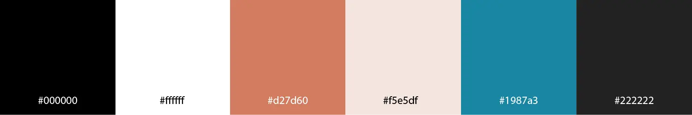

### Typography

Google Fonts was used to import the selected fonts for the site, ensuring high-quality and easily accessible typography.

* **h1, h2 and h3 headings:** The font [Montserrat](https://fonts.google.com/specimen/Montserrat?preview.text=Get%20ready%20to%20elevate%20your%20event&query=open+sans) was chosen for its modern, clean, and sans-serif style. This typeface draws inspiration from the traditional posters and signs of the Montserrat neighbourhood in Buenos Aires, lending a sense of history while maintaining a contemporary aesthetic.

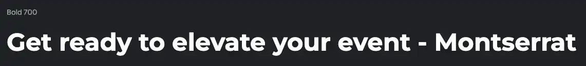

* **paragraph elements:** The font [Open Sans](https://fonts.google.com/specimen/Open+Sans) was chosen for it's friendly and approchable look. With its humanist design, open letterforms, and low x-height, Open Sans delivers both warmth and readability. Its versatility and high legibility make it an excellent choice for paragraph text, ensuring a comfortable reading experience across various devices and screen sizes.

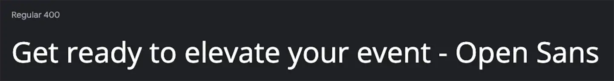

* **social media icons:** [Font Awesome](https://fontawesome.com/) library icons were used for the social media icons and icons in the mixes section.

### Imagery

The imagery on the site was chosen to reflect the vibrancy and minimalist aesthetic of the hero image. High-contrast visuals with bright, bold colours create an engaging and visually striking experience for users. The use of dynamic imagery complements the mood of the site, drawing attention while maintaining a clean, modern design. All images were sourced from [Adobe Stock](https://stock.adobe.com/).

### Wireframes

Wireframes for mobile, tablet, and desktop views were created using [Balsamiq](https://balsamiq.com/). These wireframes helped map out the structure and layout of the site, ensuring a seamless user experience across all devices. The design process focused on responsive layout adjustments to provide an intuitive interface for users on various screen sizes.

#### Mobile Wireframes

 Click here to see the Mobile Wireframe 

- Home page wireframe

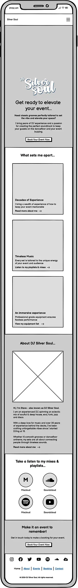

- About page wireframe

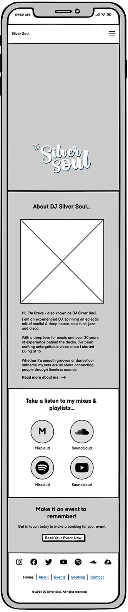

- Booking page wireframe

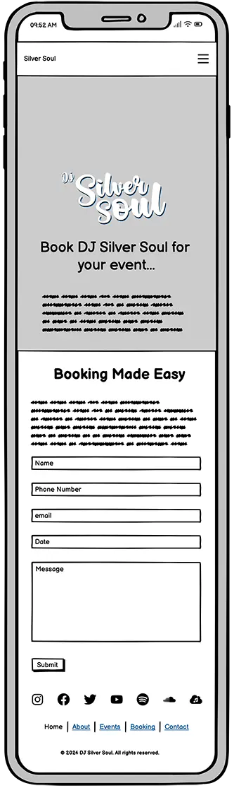

- Success page wireframe

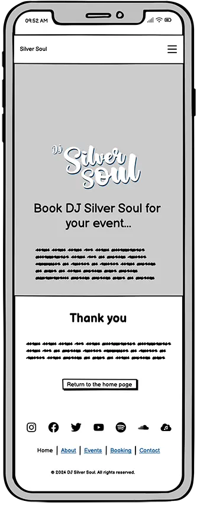

- 404 page wireframe

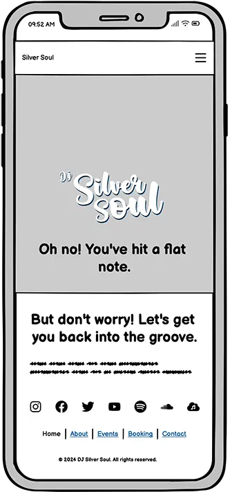

#### Tablet Wireframes

 Click here to see the Tablet Wireframe 

- Home page wireframe

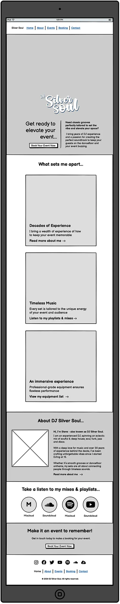

- About page wireframe

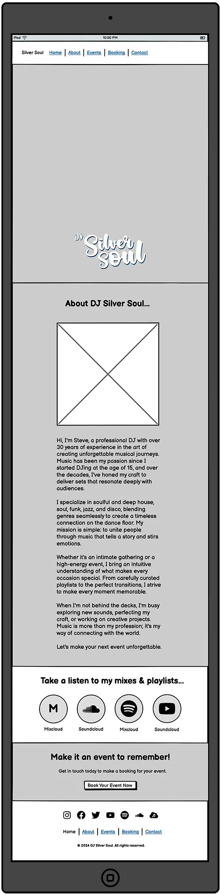

- Booking page wireframe

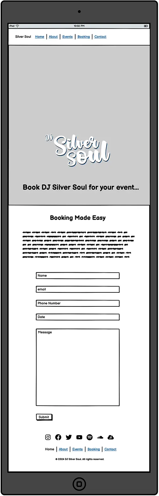

- Success page wireframe

- 404 page wireframe

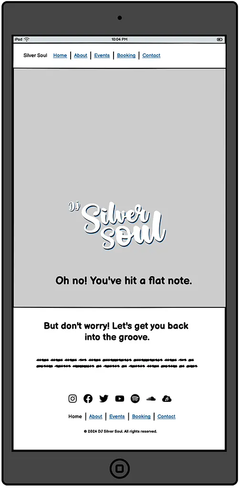

 

 #### Desktop Wireframes

 Click here to see the Desktop Wireframes 

- Home page wireframe

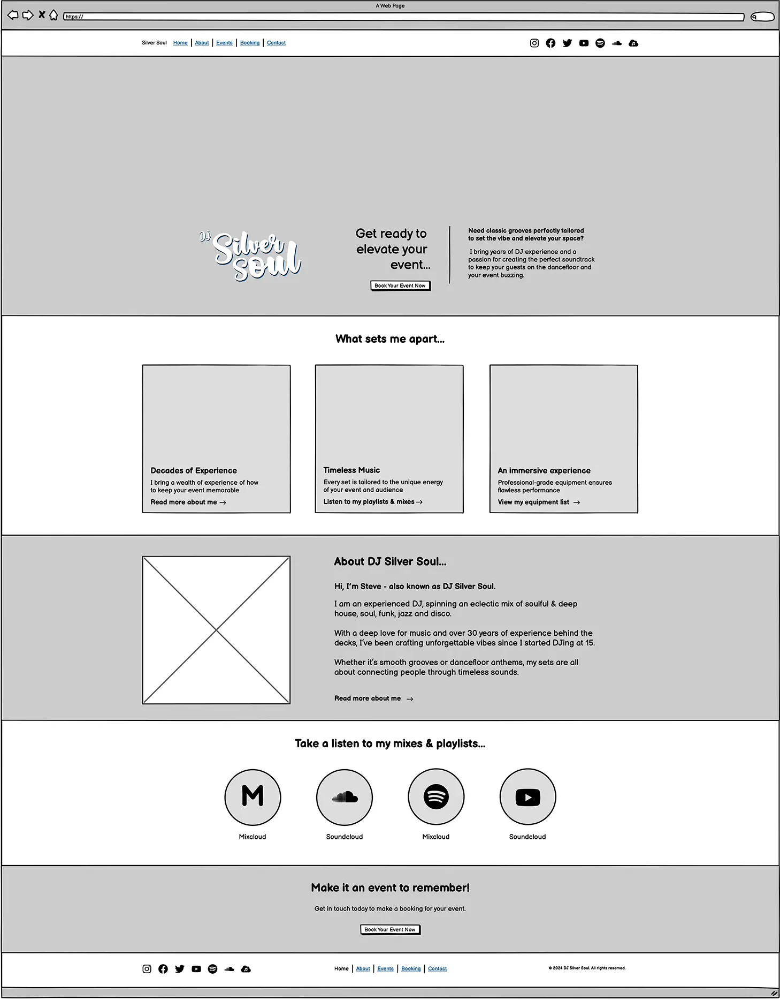

- About page wireframe

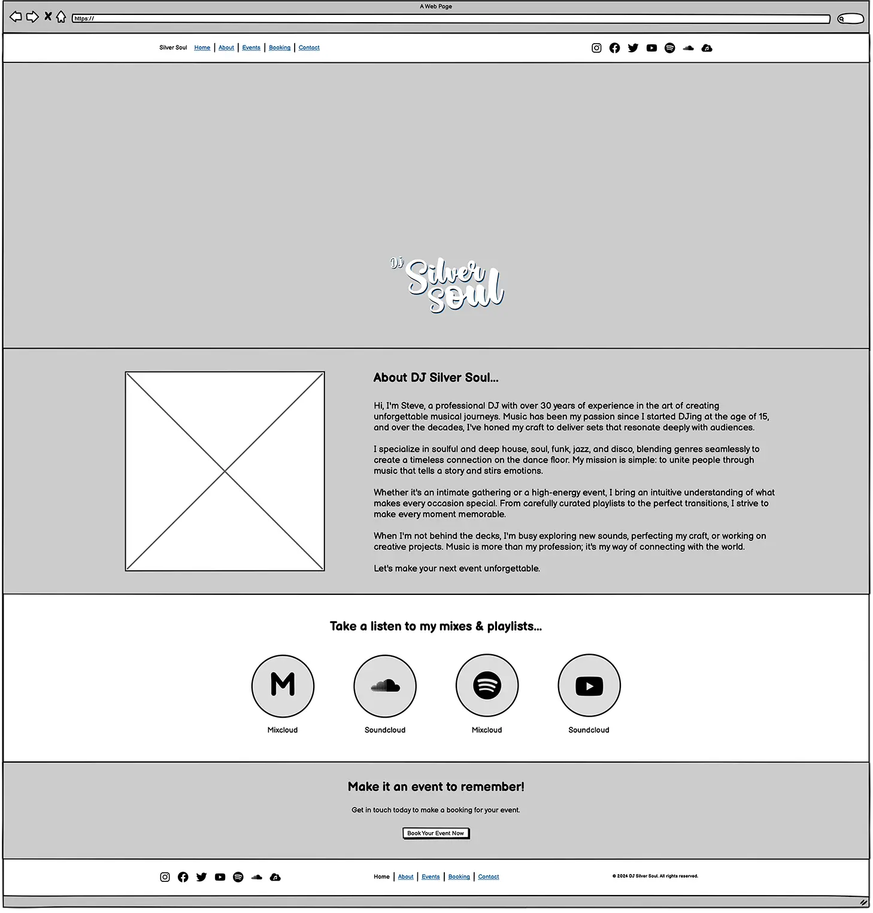

- Booking page wireframe

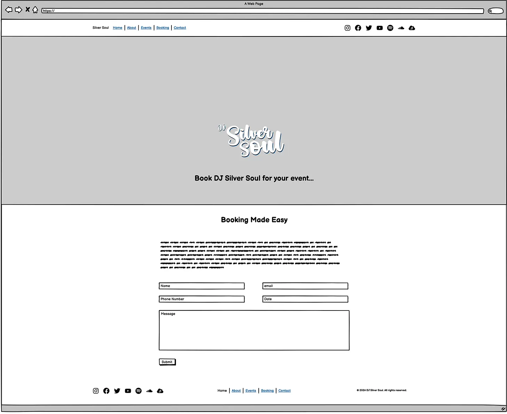

- Success page wireframe

- 404 page wireframe

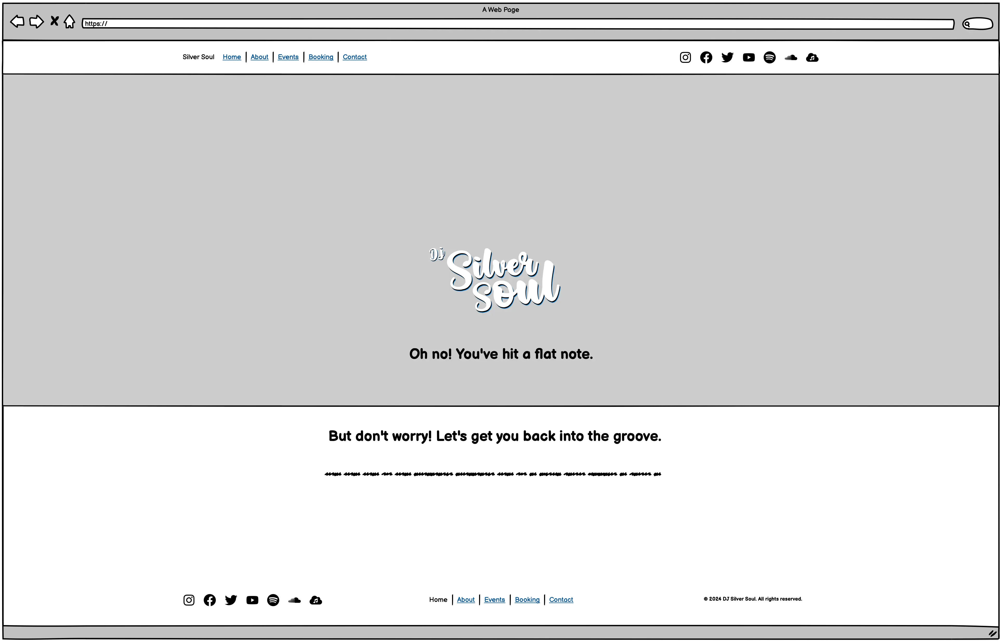

 

### Features

The website is comprised of a home page, an about page, a booking form page and a form submit success page.

All Pages on the website are responsive and have:

* A favicon in the browser tab.

 Click here to view the favicon 

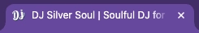

#### The Home Page

 Click here to view the home page 

---

The home page is designed to provide an engaging and welcoming introduction to the DJ’s services. Key features include:

1. **Hero Section:** A visually captivating banner with the DJ’s logo, tagline, and a clear call-to-action button for easy navigation.
2.	**Unique Selling Points (USPs):** Highlights of the DJ’s experience, musical expertise, and state-of-the-art equipment through visually appealing cards with background imagery.
3. **Featured Mixes:** Interactive links to popular mixes, offering visitors a chance to experience the DJ’s sound directly.
4. **Call-to-Action:** A booking section that encourages users to inquire about the DJ’s availability for events.
5. **Footer:** A clean footer with social media links and site navigation, ensuring easy access to additional information.

The home page is optimized for both first-time and returning visitors, ensuring an intuitive and aesthetically pleasing user experience.

#### The About Page

 Click here to view the about page 

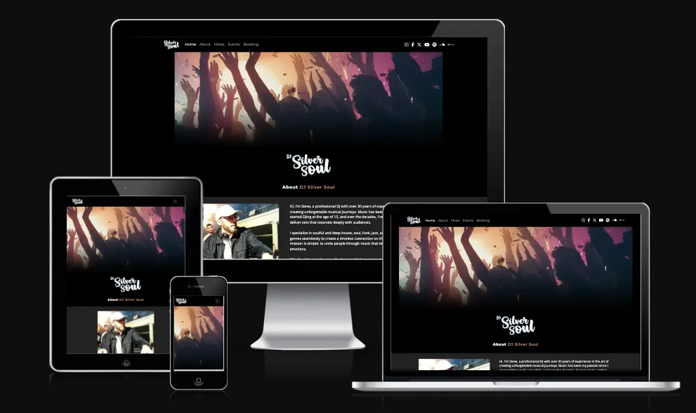

---

The About page provides a comprehensive introduction to the DJ and their services, focusing on building trust and connection with visitors. Key features include:

1. **Hero section:** A vibrant banner with the DJ’s logo and section heading.
2. **Introduction to the DJ:** A compelling narrative about the DJ’s journey, expertise, and passion for music.
3. **Image of the DJ:** Showing the DJ at work with vinyl records, highlighting the DJ's expertise.
4. **Featured Mixes:** Another opportunity for the use to access interactive links to popular mixes, offering visitors a chance to experience the DJ’s sound directly.
4. **Call-to-Action:** A booking section that encourages users to inquire about the DJ’s availability for events.

The About page’s purpose is to showcase the DJ’s story, establish credibility, and inspire visitors to learn more or book their services.

#### The Booking Page

 Click here to view the booking page 

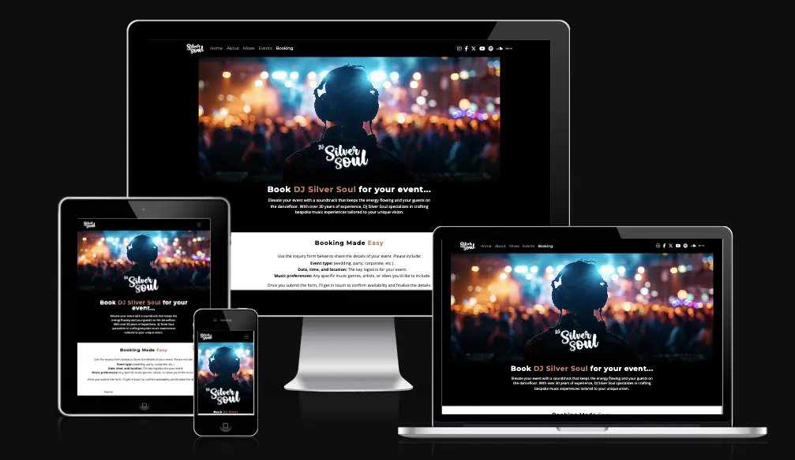

---

The booking page is designed to streamline event inquiries, ensuring that potential clients can easily communicate their event details. Key features include:

*	A booking enquiry form with instructions for the user of the specific information required: 
	1. **Event Type:** Asking the user to specify the type of event (e.g., wedding, party, corporate event).
	2. **Date, Time & Location:** Asking the user to input the event’s scheduled date and time, ensuring the DJ’s availability aligns with their needs.
    3. **Music Preferences:** Asking the user to share specific genres, artists, or overall vibes they want to include, helping tailor the music to their vision.

*   Form fields are provided for the user to input their information
    1. **Contact Information:** Fields for name, email, and phone number to enable seamless follow-up communication.
    2. **Date of Event:** A field with a date picker makes it easy for the user to choose a specific date.
	3. **Additional Message:** A text area for clients to include any extra details or specific requests listed in the introductory text.
	
*   **Instructions and Guidance:** Clear, concise text explaining how to complete the form and what to expect after submission.
	1. **Submit Confirmation:** Upon submission, users are directed to a success page confirming receipt of their inquiry and outlining the next steps.

The booking page’s purpose is to simplify the inquiry process while gathering all the necessary details to ensure a tailored and professional service.

#### The Success Page

 Click here to view the success page 

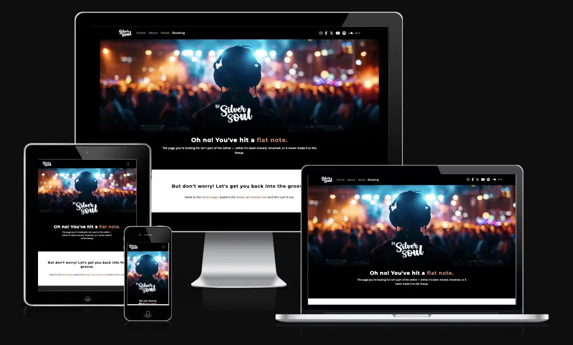

---

The Success page confirms the successful submission of the booking form, displaying a message of gratitude and reassurance that the DJ will be in touch soon.

*   A button is provided for the user to quickly access the Home page.

The Success page's purpose is to reassure the user stays connected and guided while maintaining a consistent and professional user experience.

#### The 404 Page

 Click here to view the success page 

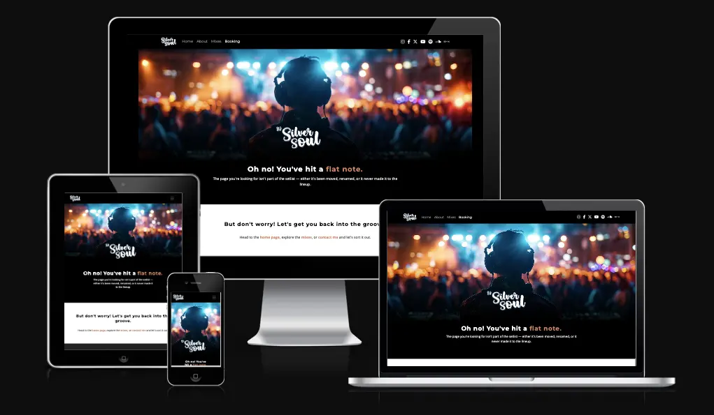

---

The 404 page provides a clear and engaging message to inform users they’ve reached a non-existent or unavailable page.

*    It features helpful links to navigate back to the **homepage**, the **mixes section** of the homepage or the **booking** page.

The purpose of the 404 page is to guide users when they land on a non-existent page.

#### Future Implemetations

To ensure the website remains engaging and functional for users, in future implementations I would like to:

1. Introduce a dedicated page showcasing upcoming events where the DJ will perform. This page will help raise awareness, keep fans informed, and encourage attendance.
2. Embed music samples or live DJ mixes for visitors to listen to directly on the website.
3. Integrate a photo and video gallery to showcase past events and performances.
4. Implement an interactive booking calendar to streamline the booking process.
5. Add social media links with real-time content feeds to showcase latest updates, gigs, and testimonials.
6. Allow visitors to sign up for a newsletter to stay updated on upcoming events, mixes, and special offers.
7. Add a Dropbox link so users can submit videos and pictures taken at events for use on social media.
8. Add a chat or virtual assistant to answer inquiries instantly.

---

## Technologies Used

### Languages Used

HTML, CSS, Bootstrap

### Frameworks, Libraries & Programs Used

* [Balsamiq](https://balsamiq.com/) - Used to create wireframes.

* [Palette Generator tool](https://palettegenerator.com/) - Used to create colour palette for the site.

* [Adobe Illustrator](https://www.adobe.com/uk/products/illustrator.html) - Used to design the logo and create visuals.

* [Adobe Photoshop](https://www.adobe.com/uk/products/photoshop.html) - Used to crop, resize, edit and save images to webp format.

* [Git](https://git-scm.com/) - For version control.

* [Github](https://github.com/) - To save and store the files for the website.

* [GitPod](https://gitpod.io/) - IDE used to create the site.

* [Bootstrap](https://getbootstrap.com/) - Open-source CSS framework used for nav and form elements of the site.

* [Google Fonts](https://fonts.google.com/) - To import the fonts used on the website.

* [Font Awesome](https://fontawesome.com/) - Icon library toolkit for social media icons.

* [Google Developer Tools](https://developers.google.com/web/tools) - To troubleshoot and test features, solve issues with responsiveness and styling.

* [Am I Responsive?](http://ami.responsivedesign.is/) - To show the website image on a range of devices.

* [Aria DevTools](https://github.com/ziolko/aria-devtools) - Used to view the website the way screen readers present it to blind users.

* [Webpage Spell-Check](https://chrome.google.com/webstore/detail/webpage-spell-check/mgdhaoimpabdhmacaclbbjddhngchjik/related) - a google chrome extension that allows you to spell check your webpage. Used to check the site and the readme for spelling errors.

---

## Deployment & Local Development

### Deployment

The site is deployed using GitHub Pages - [Dj Silver Soul](https://sd-powell.github.io/portfolio_project_1/).

To Deploy the site using GitHub Pages:

1. Login (or signup) to Github.
2. Go to the repository for this project, [sd-powell/portfolio_project_1](https://github.com/sd-powell/portfolio_project_1).
3. Click the settings button.
4. Select pages in the left hand navigation menu.
5. From the source dropdown select main branch and press save.
6. The site has now been deployed, please note that this process may take a few minutes before the site goes live.

### Local Development

#### How to Fork

To fork the repository:

1. Log in (or sign up) to Github.
2. Go to the repository for this project, [sd-powell/portfolio_project_1](https://github.com/sd-powell/portfolio_project_1).
3. Click the Fork button in the top right corner.

#### How to Clone

To clone the repository:

1. Log in (or sign up) to GitHub.
2. Go to the repository for this project, [sd-powell/portfolio_project_1](https://github.com/sd-powell/portfolio_project_1).
3. Click on the code button, select whether you would like to clone with HTTPS, SSH or GitHub CLI and copy the link shown.
4. Open the terminal in your code editor and change the current working directory to the location you want to use for the cloned directory.
5. Type 'git clone' into the terminal and then paste the link you copied in step 3. Press enter.

---

## Testing

Please refer to [TESTING.md](TESTING.md) file for all testing carried out.

### Solved Issues & Bugs

| No | Bug                                  | How I solved the issue                              |
| :- | :----------------------------------- | :-------------------------------------------------- |
| 1  | When the html code was first tested using the w3c validator, the report showed a button class had been incorrectly used rather than an anchor tag for the call to action buttons. | The `<button>` tag was changed to an `<a>` tag on all pages featuring the CTA buttons. |
| 2  | The Lighthouse report showed that accessibility could be improved on the 'Book Your Event Now' buttons. As background and foreground colours do not have a sufficient contrast ratio.  | A darker shade of `#1987a3` was found using [Colorkit.co](https://colorkit.co/color-shades-generator/) and the colour was replaced in the `:root` css variable with `#14758d` |
| 3  | The booking form allowed white space characters to be accepted by the validation when submitting the form. | White space validation was implemented on the `<input>` tag using regular expression `required pattern="\S(.*\S)?" title="This field is required"`.
| 4. | The 'Read more...' link on the about section of the home page was centered when viewing on mobile devices | I used Chrome Developer Tools to identify there was a `text-align: center;` css rule applied to the parent container. I removed this rule in order to fix the issue. |
| 5. | When viewing the booking form on smaller devices, there was no space between the submit button and the footer. | I used Chrome Developer Tools to identify the container section `#booking-form` and applied a css rule to it of `margin-bottom: 20px`to solve the issue and create space between the button and footer. |
| 6. | Viewing the site using Chrome Developer Tools in the iPhone 5/SE preview, the hero text was pushing up into the logo. | I used a media query `@media (max-width: 353px)` and applied rules to make the logo smaller `.hero__logo img {top: 43%; width: 160px;}` and align it to a higher postion on the page. I also applied a rule to the hero container to allow more room for the text `.hero {height: 685px; padding-top: 20rem;}`. |
| 7. | I identified that when the viewport width is increased between 1050px and 1200px, the hero image wasn't wide enough to display full screen. | I used another media query `@media only screen and (min-width: 1050px)` to load a 1200px wide image which solved the issue. |
| 8. | When viewing the success and 404 pages on smaller devices, there was excessive space between the content and footer. | I used Chrome Developer Tools to identify that the css rule `min-height: 100vh;` applied to the class `.section-light` was causing the issue. The removal of this rule fixed the issue. |

---

## Credits

* I used this [github cheatsheet](https://github.com/adam-p/markdown-here/wiki/Markdown-Cheatsheet) as a reference for how to format markdown.
* I found this [YouTube tutorial](https://www.youtube.com/watch?v=EKqhENATIKg) by [Patrick Jackson](https://www.youtube.com/@TheWinnieston) and [article](https://www.eddymens.com/blog/markdown-table-of-contents-toc-how-to-create-one) useful to learn how to use markdown anchor links.
* [This article](https://stackoverflow.com/questions/14675913/changing-image-size-in-markdown) helped me with resizing images in markdown.
* [Colorkit.co](https://colorkit.co/color-shades-generator/) helped to find darker shades of hex colours to improve accessibility.
* This [Stack Overflow](https://stackoverflow.com/questions/55411492/media-queries-not-respecting-size) article helped me understand how to use a min-width media query to allow the site to re-size on smaller devices.
* This [px to rem converter](https://nekocalc.com/px-to-rem-converter) helped me convert sizes to rem.
* To understand which device breakpoints to use, I referenced this [w3cschools](https://www.w3schools.com/howto/howto_css_media_query_breakpoints.asp) article.

### Inspiration

* The following websites were helpful while researching the online presence of DJs.
    * [DJ Danny Nutt](https://www.djdannynutt.com/)
    * [DJ Louie Vega](https://louievega.com/)
    * [DJ Todd Terry](https://www.toddterry.com/)
    * [Soulful House Collective](https://www.soulfulhousecollective.com/)
* The following websites provided design inspiration.
    * [Bellroy Carry Goods](https://bellroy.com/)

### Content

All content for the site is written by myself.

### Media

* [Adobe Stock](https://stock.adobe.com/) - Used to source royalty free imagery for the site.

### Acknowledgments

I would like to acknowledge the following people:

* [Jubril Akolade](https://github.com/Jubrillionaire) - My Code Institute Mentor.

* [Young Pulse](https://www.instagram.com/youngpulse/?hl=en) - Whose DJ images are used on the home and about pages.

* Ax de Klerk, Jordan Acomba & Robert Lewis - My fellow Code Institute cohort, who helped each other over the course of our first milestone projects.

* The Code Institute Slack channel Peer Code Review - Thank you to everyone who took the time to view my site and look over the code.