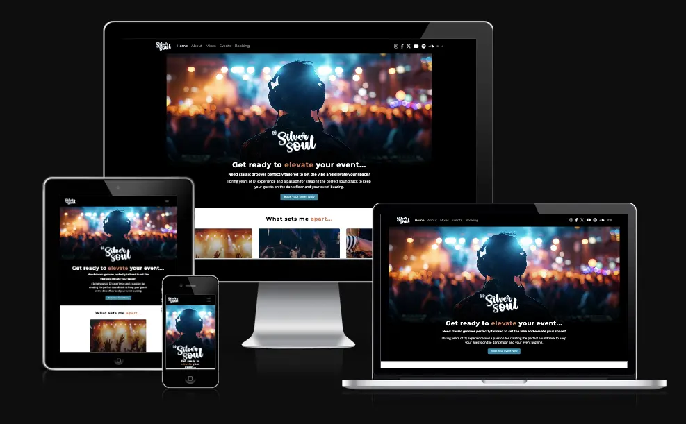
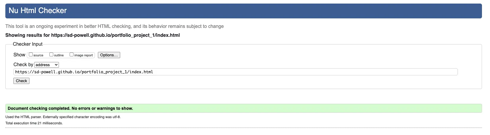
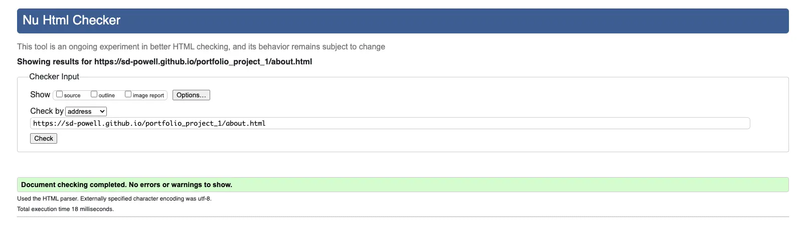
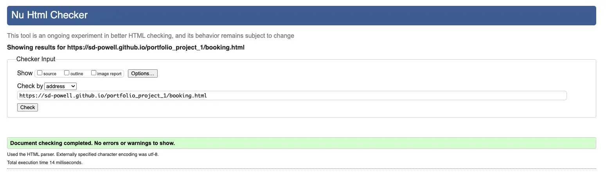
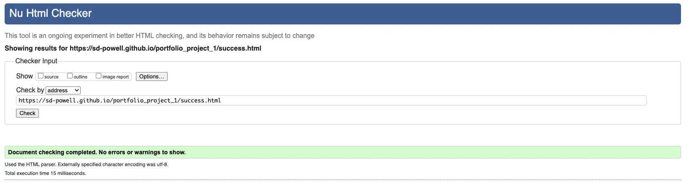
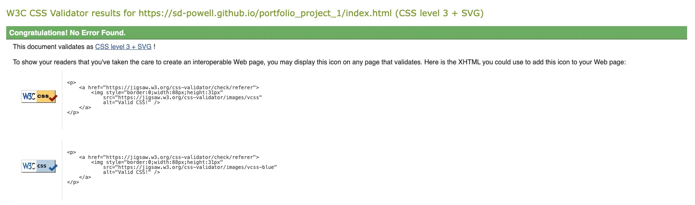
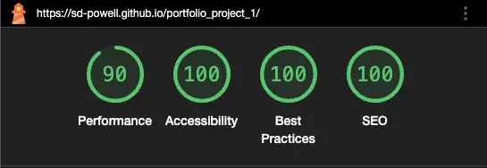
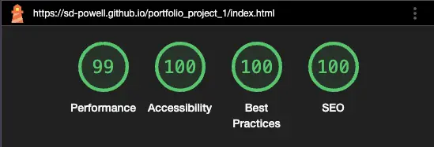
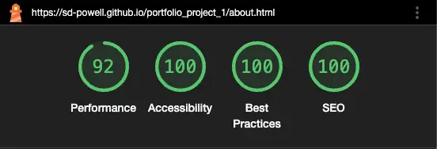

# Testing

---

Visit the deployed site here: [DJ Silver Soul](https://sd-powell.github.io/portfolio_project_1/)

---

## CONTENTS

* [AUTOMATED TESTING](#)
  * [W3C Validator](#)
  * [W3C CSS Validator](#)
  * [Lighthouse](#)
* [MANUAL TESTING](#)

Testing was conducted continuously throughout the development process to ensure a functional and user-friendly website. Chrome Developer Tools were extensively utilised during the build to identify and resolve issues promptly. Regular testing allowed for a smoother development process and ensured the final product met quality standards.

Throughout the development process, ChatGPT was utilized as a valuable resource for brainstorming ideas, refining content, and troubleshooting challenges. By offering alternative solutions and best practices, ChatGPT contributed significantly to the website’s overall quality and functionality.

Each page is tested using Chrome Developer Tools to ensure that it is responsive on a variety of different screen sizes and devices.

---

## AUTOMATED TESTING

### W3C Validator

[W3C](https://validator.w3.org/) was used to validate the HTML on all pages of the website.

| Directory                             | File tested  | Screenshot                                           | Notes                            |
| ------------------------------------- | ------------ | ---------------------------------------------------- | -------------------------------- |
| documentation/testing-w3-index.webp   | index.html   |    | no errors occurred when checking |
| documentation/testing-w3-about.webp   | about.html   |    | no errors occurred when checking |
| documentation/testing-w3-booking.webp | booking.html |  | no errors occurred when checking |
| documentation/testing-w3-success.webp | success.html |  | no errors occurred when checking |

---

### CSS Validator

[CSS W3C Validator](https://jigsaw.w3.org/css-validator/) was used to validate my CSS file.

| Directory                                | File tested  | Screenshot                                              | Notes                            |
| ---------------------------------------- | ------------ | ------------------------------------------------------- | -------------------------------- |
| documentation/testing-w3css-success.webp | style.css    |  | no errors occurred when checking |

---

### Lighthouse

I've tested my deployed project using the Lighthouse Audit tool to to test the performance, accessibility, best practices and SEO of the website.

| Page    | Mobile                                                   | Desktop                                                   | Notes |
| ------- | -------------------------------------------------------- | --------------------------------------------------------- | ----- |
| Home    |  |  | Works as expected.  |
| About   | |  | Works as expected. |
| Booking | -------------------------------------------------------- | --------------------------------------------------------- | Works as expected. |
| Success | -------------------------------------------------------- | --------------------------------------------------------- | Works as expected. |

