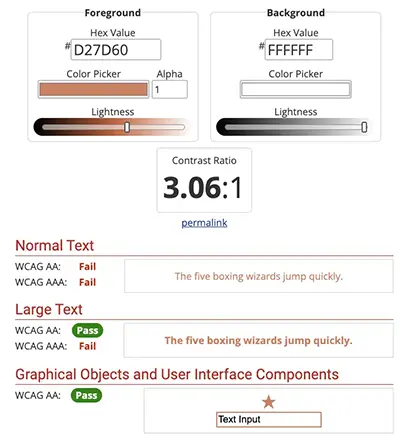
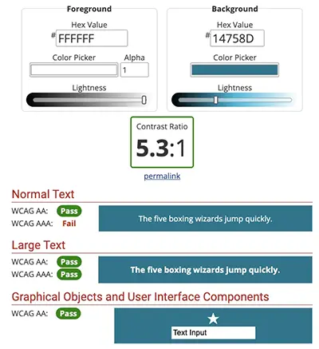

# Testing

---

Visit the deployed site here: [DJ Silver Soul](https://sd-powell.github.io/portfolio_project_1/)

---

## CONTENTS

* [AUTOMATED TESTING](#item-one)
  * [W3C Validator](#item-two)
  * [W3C CSS Validator](#item-three)
  * [Lighthouse](#item-four)
* [MANUAL TESTING](#item-five)
  * [Full Testing](#item-six)
  * [Browser Compatibility](#item-seven)
  * [Responsiveness](#item-seven)
  * [Accessibility](#item-eight)
  * [Testing User Stories](#item-nine)
  * [Features Testing](#item-ten)

Testing was conducted continuously throughout the development process to ensure a functional and user-friendly website. Chrome Developer Tools were extensively utilised during the build to identify and resolve issues promptly. Regular testing allowed for a smoother development process and ensured the final product met quality standards.

Throughout the development process, ChatGPT was utilised as a valuable resource for brainstorming ideas, refining content, and troubleshooting challenges. By offering alternative solutions and best practices, ChatGPT contributed significantly to the website’s overall quality and functionality.

Each page is tested using Chrome Developer Tools to ensure that it is responsive on a variety of different screen sizes and devices.

---

## AUTOMATED TESTING

### W3C Validator

[W3C](https://validator.w3.org/) was used to validate the HTML on all pages of the website.

| Directory                             | File tested  | Screenshot                                           | Notes                            |
| ------------------------------------- | ------------ | ---------------------------------------------------- | -------------------------------- |
| documentation/testing-w3-index.webp   | index.html   |    | no errors occurred when checking |
| documentation/testing-w3-about.webp   | about.html   |    | no errors occurred when checking |
| documentation/testing-w3-booking.webp | booking.html |  | no errors occurred when checking |
| documentation/testing-w3-success.webp | success.html |  | no errors occurred when checking |
| documentation/testing-w3-success.webp | 404.html |  | no errors occurred when checking |

---

### CSS Validator

[CSS W3C Validator](https://jigsaw.w3.org/css-validator/) was used to validate my CSS file.

| Directory                                | File tested  | Screenshot                                              | Notes                            |
| ---------------------------------------- | ------------ | ------------------------------------------------------- | -------------------------------- |
| documentation/testing-w3css-success.webp | style.css    |  | no errors occurred when checking |

### Lighthouse

I've tested my deployed project using the Lighthouse Audit tool to to test the performance, accessibility, best practices and SEO of the website.

| Page    | Mobile                                                      | Desktop                                                      | Notes |
| ------- | ----------------------------------------------------------- | ------------------------------------------------------------ | ----- |
| Home    |     |     | Works as expected.  |
| About   |    |     | Works as expected. |
| Booking |  |  | Works as expected. |
| Success |  |  | Works as expected. |
| 404 |  |  | Works as expected. |

---

## MANUAL TESTING

### Full Testing

Full testing was performed on the following physical devices:

* Desktop:
  * Mac Studio 2022 LG HDR 4k screen
* Laptop:
  * Macbook Pro 2023 16 inch screen
* Tablet:
  * iPad Pro 12.9in 2017
* Mobile Devices:
  * iPhone 11
  * iPhone 12 pro
  * iPhone XR

  Additional testing was taken by friends and family on a variety of devices and screen sizes.

### Browser Compatibility

- [Safari](https://www.apple.com/uk/safari/)
- [Chrome](https://www.google.com/chrome)
- [Firefox](https://www.mozilla.org/firefox)
- [Bing](https://www.bing.com/)
- [Edge](https://www.microsoft.com/en-gb/edge?form=MA13FJ)

I tested my deployed project on multiple browsers to check for compatibility issues.

| Browser tested | Intended appearence | Intended responsiveness |
| -------------- | ------------------- | ----------------------- |
| Safari         | Good                | Good                    |
| Chrome         | Good                | Good                    |
| Firefox        | Good                | Good                    |
| Bing           | Good                | Good                    |
| Edge           | Good                | Good                    |

## Responsiveness

In addition to testing my deployed site on different devices, I thoroughly tested the site's responsiveness using Chrome Developer Tools.
I searched for information on [Stack Exchange](https://ux.stackexchange.com/questions/74798/are-there-devices-narrower-than-320px-and-data-on-their-usage-for-web-browsing) for the narrowest width of modern devices and based my testing on 320px.

| Device tested | Site responsive >=700px | Site responsive <699px | Renders as expected |
| ------------- | ----------------------- | ---------------------- | ------------------- |
| iPhone 5/SE   | N/A                     | Good at 320px          | Good                |
| Galaxy S8     | N/A                     | Good at 350px          | Good                |
| iPhone 6/7/8  | N/A                     | Good at 375px          | Good                |
| iPhone 12 Pro | N/A                     | Good at 390px          | Good                |
| iPhone 6/7/8 Plus | N/A                 | Good at 414px          | Good                |
| iPad Pro      | Good at 1024px          | N/A                    | Good                |
| Nest Hub Max  | Good at 1280px          | N/A                    | Good                |
| Mac Studio    | Good at 2500px +        | N/A                    | Good                |

## Accessibility

In addition to the automated tests for accessibility standards, I used [WebAIM](https://webaim.org/resources/contrastchecker/) to test the contrast of the colours on the site for visually impaired users.

| Foreground colour | Background colour | Testing results |
| ----------------- | ----------------- | --------------- |
| `#D27D60`         | `#000000`         | |
| `#D27D60`         | `#FFFFFF`         | |
| `#000000`         | `#F5E5DF`         | |
| `#1FA2C2`         | `#222222`         | |
| `#FFFFFF`         | `#14758D`         | |

---

### Testing User Stories

`First Time Visitors`

| Goals | How are they achieved? |
| :--- | :--- |
| As a new site user, I want to learn about the DJ’s background, style, and experience so that I can connect with their journey and understand why they’re the right choice for my event or music needs. | The site provides a comprehensive narrative of the DJ's journey, specialties, and passion for music, helping users decide if the DJ aligns with their preferences. |
| As a new site user, I want to browse and listen to sample mixes or sets to understand the DJ’s style and see if it suits my preferences or event. | The Mixes section directly addresses the need for visitors to explore the DJ's work before making a decision. |
| As a new site user, I want to clearly understand what makes the DJ unique, so that I can decide if their style and services match my event needs. | The combination of narrative (About Page) featuring the DJ's story and tangible proof of their work and style (Mixes Section) allows the user to decide what makes the DJ unique. |
| As a new site user, I want to fill out a booking inquiry form with event details, so I can get a response with availability and pricing. | The booking form reinforces the DJ's adaptability and ability to tailor sets to event needs, complementing the user’s decision-making process. |
| As a new site user, I want to see links to the DJ’s social media profiles so I can follow and engage with the DJ on different platforms. | The site provides the user with the opportunity to connect with the DJ on social media using the links in both the navbar, footer amd mixes section. |

`Returning Visitors`

| Goals | How are they achieved? |
| :--- | :--- |
| As a returning site user, I want quick access to the DJ’s contact details so that I can reach out directly for repeat bookings. | The site provides a link to the booking page in both the header and footer for easy access to the user. |
| As a returning site user, I want to share a link to share the site with friends, family, or colleagues who might need a DJ. | The user is able to bookmark or share the link to the site, or social media links, with their contacts you might require a DJ. |
| As a returning site user, I want to access the social media profiles or any other content tied to the DJ's professional presence. | The DJ's social media links are displayed on the navbar, footer and mixes section for easy access to the user. |
| As a returning site user, I want to revisit the site for inspiration, such as reading about the DJs style or listening to the latest mixes. | New content can be accessed by the user in the social media links or mixes section. |

---

### Features Testing

#### Existing Features

`Home Page`

* **Navigation Bar**
  * Featured on all four pages, the fully responsive navigation bar includes links to the logo, Home page, About page, Mixes section (home page) and Booking page. Social media links are also provided. It is identical on each page to allow for easy navigation.
  * This section will allow the user to easily navigate from page to page across all devices without having to revert back to the previous page via the browser 'back' button.

  

  
Click here to see the Navigation Bar

  
  
 
   

* **The Hero image**
  * The landing page presents the user with a vibrant hero image of a DJ at an event with a large crowd. Portraying the DJs experience of large venues. The image is reinforced with the main heading and question to the user. The answer paragraph text informs the user of the DJ's experience and passion for music. A button is provided for the user to access the booking page to make an enquiry.
  * The hero section makes a eye catching first impression to the user on the landing page. It reinforces the DJ's message and fulfils the aim of the website to secure bookings.

  

  
Click here to see the Hero image

  
  
 
   

* **USPs section**
  * The Unique Selling Points (USPs) section highlights the DJ’s distinctive qualities, setting them apart from competitors. It is presented through three visually appealing cards, each pairing a concise message with a relevant image to emphasize the uniqueness. This combination of text and visuals ensures key attributes are communicated effectively to the audience.
  * The USP section provides users with a clear and engaging understanding of what makes the DJ exceptional, helping them make an informed decision about booking.

  

  
Click here to see the USPs section

  
  
 
   

* **About section**
  * The About section introduces the DJ’s extensive experience, musical expertise, and passion for creating unforgettable events, conveyed through engaging text and a professional image. The user can learn more about the DJ by clicking on the link to the About page.
  * This section builds trust and connection by showcasing the DJ’s credibility, talent, and dedication, making users feel confident in their choice.

  

  
Click here to see the About section

  
  
 
   

* **Mixes section**
  * The Mixes section provides direct links to the DJ’s curated playlists and live sets on popular platforms like Mixcloud, Soundcloud, Spotify, and YouTube, displayed with clear visuals and captions. The links open in a seprarate tab, allowing the user to return to the website easily. A link to this section is provided in the navbar, USP section and footer.
  * This section allows users to explore and experience the DJ’s style and versatility, helping them make an informed decision for their event.

  

  
Click here to see the Mixes section

  
  
 
   

* **CTA section**
  * The Call-to-Action (CTA) section invites users to book the DJ for their events, featuring an engaging headline, supportive text, and a prominent button linking to the booking form.
  * Upon reaching the end of the home page, this section provides a quick and easy way for users to take action, ensuring they can secure the DJ’s services for their event without hassle.

  

  
Click here to see the CTA section

  
  
 
   

* **Footer**
  * The footer provides quick links to key pages, social media icons for connecting with the DJ, and copyright information, ensuring comprehensive site navigation and accessibility.
  * This section allows users to easily explore the website further or connect with the DJ on various platforms, enhancing engagement and convenience. Quick links allow the user easy navigation once reaching the bottom of the page if using mobile devices.

  

  
Click here to see the footer

  
  
 
   

`About Page`

* **The About hero image**
  * The About page hero showcases a lively and vibrant image of an energetic crowd immersed in the music at an event. The DJ’s logo is prominently overlaid, reinforcing brand identity while setting the tone for the page.
  * The value to the user lies in the engaging visual representation of the DJ’s ability to create a lively atmosphere, building trust and excitement about their capability to deliver memorable experiences.

  

  
Click here to see the About hero image

  
  
 
   

* **The About page text**
  * The About page provides the user with further information on DJ Silver Soul, highlighting their 30+ years of experience, passion for music, and commitment to delivering unforgettable events.
  *  Offers the user insight into the DJ’s expertise and unique style, building trust and connection with potential clients.

  

  
Click here to see the About page text

  
  
 
   

`Booking Page`

* **The Booking page hero**
  * The Booking page re-uses the dynamic hero image on the home page, showcasing a lively event atmosphere, complemented by the DJ’s logo to reinforce branding and professionalism. A call to action reminds the user about booking the DJ and provides a reminder to the user on why the DJ is unique.
  * Creates an engaging and professional first impression for the user, inspiring the user with confidence to proceed with booking inquiries.

  

  
Click here to see the Booking page hero

  
  
 
   

* **The Booking page form**
  * The Booking page form allows users to easily submit their event details, including type, date, location, and music preferences, for a tailored DJ experience. 'The Booking Made Easy' text reassures the user and explains what information is required from them.
  * The form provides the user with a seamless, user-friendly way to communicate event specifics, ensuring personalized service and simplifying the booking process.

  

  
Click here to see the Booking page form

  
  
 
   

`Success Page`

* **The Success Page**
  * The Success page confirms the successful submission of the booking form, displaying a message of gratitude and reassurance that the DJ will be in touch soon. A button is provided for the user to quickly access the Home page.
  * Offers the user reassurance and transparency, ensuring users feel their booking is confirmed and will be followed up promptly, improving the overall experience.

  

  
Click here to see the Success page

  
  
 
   

`404 Page`

* **404 Page**
  * The 404 page provides a clear and engaging message to inform users they’ve reached a non-existent or unavailable page. It features helpful links to navigate back to the homepage or other key sections of the site.
  * This ensures users stay connected and guided while maintaining a consistent and professional user experience.

  

  
Click here to see the 404 page

  
  
 
   

`Home Page`

| Feature | Expected Outcome | Testing Performed | Result | Pass/Fail |
| --- | --- | --- | --- | --- |
| Silver Soul logo in navbar | Link directs user back to home page | Clicked on logo | Home page reloads | Pass |
| Home page link in navbar | Link directs user back to home page | Clicked on link | Home page reloads | Pass |
| About page link in navbar | Link directs user to About page | Clicked on link | About page loads | Pass |
| Mixes link in navbar | Link directs user to Mixes section on home page | Clicked on link | Page scrolls to Mixes section | Pass |
| Booking link in navbar | Link directs user to Booking page | Clicked on link | Booking page loads | Pass |
| Instagram link in navbar | Link directs user to Instagram page in new tab | Clicked on link | Instagram page loads in new tab | Pass |
| Facebook link in navbar | Link directs user to Facebook page in new tab | Clicked on link | Facebook page loads in new tab | Pass |
| X(Twitter) link in navbar | Link directs user to X(Twitter) page in new tab | Clicked on link | X(Twitter) page loads in new tab | Pass |
| YouTube link in navbar | Link directs user to YouTube page in new tab | Clicked on link | YouTube page loads in new tab | Pass |
| Spotify link in navbar | Link directs user to Spotify page in new tab | Clicked on link | Spotify page loads in new tab | Pass |
| Soundcloud link in navbar | Link directs user to Soundcloud page in new tab | Clicked on link | Soundcloud page loads in new tab | Pass |
| Mixcloud link in navbar | Link directs user to Mixcloud page in new tab | Clicked on link | Mixcloud page loads in new tab | Pass |
| Book Your Event Now button on hero | Link directs user to booking page | Clicked on link | Booking page loads | Pass |
| 'Read more about me' link on first USP card | Link directs user to About page | Clicked on link | About page loads | Pass |
| 'Listen to my mixes' link on second USP card | Link directs user to Mixes section on home page | Clicked on link | Page scrolls to Mixes section | Pass |
| 'Book now with confidence' link on third USP card | Link directs user to Booking page | Clicked on link | Booking page loads | Pass |
| 'Read more about DJ Silver Soul' link in About section | Link directs user to About page | Clicked on link | About page loads | Pass |
| Mixcloud link in Mixes section | Link directs user to Mixcloud page in new tab | Clicked on link | Mixcloud page loads in new tab | Pass |
| Soundcloud link in Mixes section | Link directs user to Soundcloud page in new tab | Clicked on link | Soundcloud page loads in new tab | Pass |
| Spotify link in Mixes section | Link directs user to Spotify page in new tab | Clicked on link | Spotify page loads in new tab | Pass |
| YouTube link in Mixes section | Link directs user to YouTube page in new tab | Clicked on link | YouTube page loads in new tab | Pass |
| Book Your Event Now button on CTA section | Link directs user to booking page | Clicked on link | Booking page loads | Pass |
| Instagram link in footer | Link directs user to Instagram page in new tab | Clicked on link | Instagram page loads in new tab | Pass |
| Facebook link in footer | Link directs user to Facebook page in new tab | Clicked on link | Facebook page loads in new tab | Pass |
| X(Twitter) link in footer | Link directs user to X(Twitter) page in new tab | Clicked on link | X(Twitter) page loads in new tab | Pass |
| YouTube link in footer | Link directs user to YouTube page in new tab | Clicked on link | YouTube page loads in new tab | Pass |
| Spotify link in footer | Link directs user to Spotify page in new tab | Clicked on link | Spotify page loads in new tab | Pass |
| Soundcloud link in footer | Link directs user to Soundcloud page in new tab | Clicked on link | Soundcloud page loads in new tab | Pass |
| Mixcloud link in footer | Link directs user to Mixcloud page in new tab | Clicked on link | Mixcloud page loads in new tab | Pass |
| Home page link in footer | Link directs user back to home page | Clicked on link | Home page reloads | Pass |
| About page link in footer | Link directs user to About page | Clicked on link | About page loads | Pass |
| Mixes link in footer | Link directs user to Mixes section on home page | Clicked on link | Page scrolls to Mixes section | Pass |
| Contact link in footer | Link directs user to Booking page | Clicked on link | Booking page loads | Pass |

`About Page`

To avoid repetition, I have listed common links to the home page below as a summary. All links were fully tested and the outcome as expected above.

| Feature | Expected Outcome | Testing Performed | Result | Pass/Fail |
| --- | --- | --- | --- | --- |
| All navbar links listed above | Link directs user to specified page/section | Clicked on link | Expected page/section loads | Pass |
| Mixcloud link in Mixes section | Link directs user to Mixcloud page in new tab | Clicked on link | Mixcloud page loads in new tab | Pass |
| Soundcloud link in Mixes section | Link directs user to Soundcloud page in new tab | Clicked on link | Soundcloud page loads in new tab | Pass |
| Spotify link in Mixes section | Link directs user to Spotify page in new tab | Clicked on link | Spotify page loads in new tab | Pass |
| YouTube link in Mixes section | Link directs user to YouTube page in new tab | Clicked on link | YouTube page loads in new tab | Pass |
| Book Your Event Now button on CTA section | Link directs user to booking page | Clicked on link | Booking page loads | Pass |
| All footer links listed above | Link directs user to specified page/section | Clicked on link | Expected page/section loads | Pass |

`Booking Page`

To avoid repetition, I have listed common links to the home page below as a summary. All links were fully tested and the outcome as expected above.

| Feature | Expected Outcome | Testing Performed | Result | Pass/Fail |
| --- | --- | --- | --- | --- |
| All navbar links listed above | Link directs user to specified page/section | Clicked on link | Expected page/section loads | Pass |
| Click submit on form with no content entered | Validation displays alert to enter information in name field | Clicked on submit | Alert is shown on name field | Pass |
| Submit form with white space in name field | Validation displays alert to match the format requested | Clicked on submit | Alert is shown on name field | Pass |
| Enter text in name field and leave email field blank | Validation displays alert to enter information in email field | Clicked on submit | Alert is shown on email field | Pass |
| Enter text in email field with no @ symbol | Validation displays alert to enter @ symbol in email field | Clicked on submit | Alert is shown on email field | Pass |
| Submit form with white space in email field | Validation displays alert to match the format requested | Clicked on submit | Alert is shown on email field | Pass |
| Complete form and leave date field blank | Validation displays alert to enter information in date field | Clicked on submit | Alert is shown on date field | Pass |
| Complete form and leave message field blank | Validation displays alert to enter information in message field | Clicked on submit | Alert is shown on message field | Pass |
| Complete form with correct information | User is redirected to success page | Clicked on submit | Success page is loaded | Pass
| All footer links listed above | Link directs user to specified page/section | Clicked on link | Expected page/section loads | Pass |

`Success Page`

To avoid repetition, I have listed common links to the home page below as a summary. All links were fully tested and the outcome as expected above.

| Feature | Expected Outcome | Testing Performed | Result | Pass/Fail |
| --- | --- | --- | --- | --- |
| All navbar links listed above | Link directs user to specified page/section | Clicked on link | Expected page/section loads | Pass |
| 'Return to the home page' button on Success page | User is redirected to home page | Clicked on button | Home page is loaded | Pass |
| All footer links listed above | Link directs user to specified page/section | Clicked on link | Expected page/section loads | Pass |

`404 Page`

To avoid repetition, I have listed common links to the home page below as a summary. All links were fully tested and the outcome as expected above.

| Feature | Expected Outcome | Testing Performed | Result | Pass/Fail |
| --- | --- | --- | --- | --- |
| All navbar links listed above | Link directs user to specified page/section | Clicked on link | Expected page/section loads | Pass |
| 'Head to home page' link on 404 page | User is redirected to home page | Clicked on button | Home page is loaded | Pass |
| 'Explore the mixes' link on 404 page | User is redirected to the Mixes section on the home page | Clicked on button | Mixes section on the Home page is loaded | Pass |
| 'Contact me' link on 404 page | User is redirected to booking page | Clicked on button | Booking page is loaded | Pass |
| All footer links listed above | Link directs user to specified page/section | Clicked on link | Expected page/section loads | Pass | 